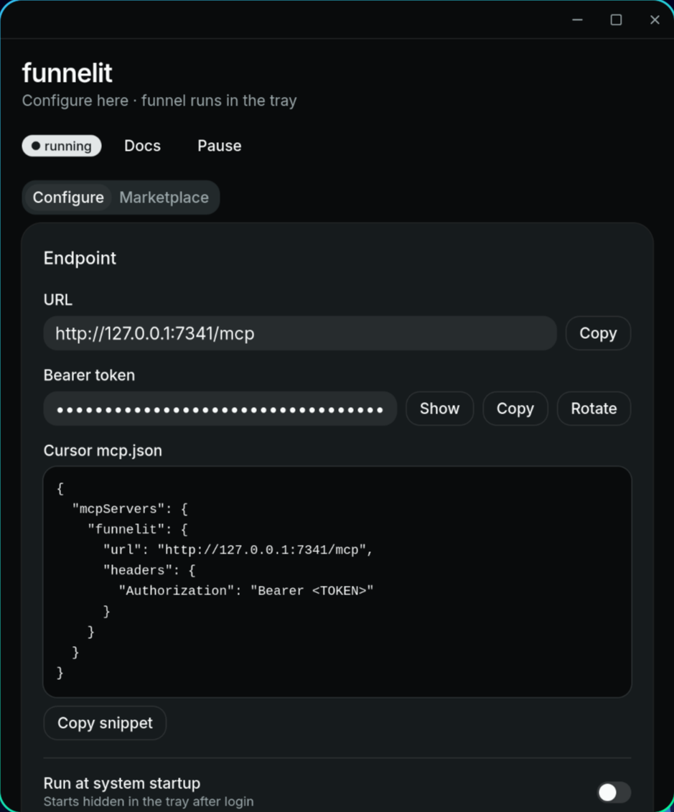
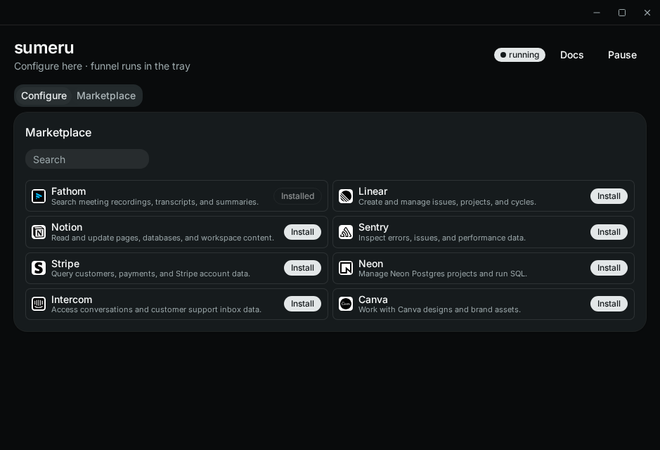

# sumeru

Formerly **funnelit**. Local desktop MCP funnel. Add N upstream MCP servers (stdio commands or HTTP URLs) and expose them through one authenticated Streamable HTTP endpoint.

**Breaking (v0.1):** app id `com.sumeru.app`, config dir, keychain service `sumeru`, CLI/npm `sumeru`, and env `SUMERU_*`. Prior funnelit installs are not migrated — reconfigure or copy config/secrets manually.

**Docs:** [GitHub Pages](https://pratyushchauhan.github.io/sumeru/) · in the app, **Docs** serves the same VitePress site locally at `http://127.0.0.1:7343`. Source is [`docs/`](docs/). Preview with `npm run docs:dev`.

**Linux AppImage on Wayland:** if you see `EGL_BAD_PARAMETER`, run with `LD_PRELOAD=/usr/lib/libwayland-client.so ./sumeru_*.AppImage` (or use the `.deb` / `.tar.gz`). Newer builds also re-exec with the host Wayland client automatically. See Docs → Linux.

<p align="center">
  
  &nbsp;
  
</p>

## Run

Frontend is Svelte 5 + Vite + [shadcn-svelte](https://www.shadcn-svelte.com/) (Rhea / mist). Dev/build are wired through Tauri:

```bash
npm install
npm run tauri dev
```

CI:
- PRs / manual: `.github/workflows/build.yml` uploads installers as workflow artifacts
- Push to `main`: `.github/workflows/release.yml` builds macOS (arm64 + x64) and Linux and publishes them to a [GitHub Release](https://github.com/PratyushChauhan/sumeru/releases) tagged `v__VERSION__` from `tauri.conf.json` (currently `v0.2.0`). Re-pushes with the same version update that release’s assets. Releases also include portable CLI binaries (`sumeru-v*-linux-x64`, `darwin-arm64`, `darwin-x64`) plus `.sha256` checksums. When `NPM_TOKEN` is set as a repo secret, the workflow publishes the [`sumeru-mcp`](packages/cli) npm package.

## npm CLI

Install the launcher (downloads the matching portable binary on first run):

```bash
npm i -g sumeru-mcp
sumeru doctor
sumeru mcp-stdio   # or just: sumeru
sumeru gui         # desktop UI
```

Cursor / MCP host stdio config example:

```json
{
  "mcpServers": {
    "sumeru": {
      "command": "sumeru",
      "args": ["mcp-stdio"]
    }
  }
}
```

Overrides: `SUMERU_BINARY` (local binary path), `SUMERU_VERSION`, `SUMERU_CACHE_DIR`.

## Funnel endpoint

The funnel starts automatically on launch and keeps running in the system tray when you close the window. Open from the tray to configure; Quit from the tray to stop the endpoint. Optionally enable **Run at system startup** (starts hidden in the tray). Pause/Resume in the UI if needed:

- URL: `http://127.0.0.1:7341/mcp`
- Auth: `Authorization: Bearer <token>` (shown/copied from the UI)
- Browser `Origin` requests are rejected
- Transport: stateless Streamable HTTP with JSON POSTs; GET `/mcp` returns a keep-alive SSE stream

Example client config:

```json
{
  "mcpServers": {
    "sumeru": {
      "url": "http://127.0.0.1:7341/mcp",
      "headers": {
        "Authorization": "Bearer <token>"
      }
    }
  }
}
```

## MCP test client

Stdlib Python client that mirrors the Cursor handshake (`initialize` → `initialized` → GET SSE → `tools/list` → `tools/call`):

```bash
# Sumeru must be running on :7341
python3 scripts/mcp_test_client.py --keyring
python3 scripts/mcp_test_client.py --keyring --clients 3
python3 scripts/mcp_test_client.py --keyring --call list_mcp_tools \
  --args '{"mcp_id":"<id>"}'
```

Token can also come from `SUMERU_TOKEN` or `--token`. Exit code `0` on pass.

## Gateway tools

Sumeru exposes exactly three MCP tools:

| Tool | Inputs | Outputs |
| --- | --- | --- |
| `list_mcps` | none | configured MCP ids, names, transports, enabled flags |
| `list_mcp_tools` | `mcp_id` | upstream tool names, descriptions, schemas |
| `execute_mcp_tool` | `mcp_id`, `tool_name`, `arguments?` | upstream `CallToolResult` |

## Upstream MCP formats

- **stdio**: paste a command (e.g. `npx`) plus args/env secrets (keychain)
- **http**: paste a Streamable HTTP MCP URL

For HTTP MCPs that advertise OAuth (RFC 9728 / 8414), sumeru shows **Sign in** and opens the provider login page in your browser. Tokens are stored in the keychain.

OAuth paths:

- **DCR** — when the authorization server supports Dynamic Client Registration, Sign in registers a client automatically (no Client ID needed)
- **No DCR** — the UI shows a short guide: create an OAuth app with the provider, register redirect URI `http://127.0.0.1:7342/oauth/callback`, paste Client ID (and secret if required) under **Advanced**, then Sign in

Manual bearer/headers also stay under **Advanced**.

Plain HTTP is allowed only for loopback hosts. Remote URLs must use HTTPS.

## Marketplace

The **Marketplace** tab lists a bundled curated catalog of HTTP MCPs that support DCR (`src/lib/marketplace.json`). **Install** runs browser OAuth first and only saves the MCP if sign-in succeeds. Non-DCR or stdio servers stay on **Configure → Add MCP**.

## Lifecycle

- Closing the window hides the UI; the MCP funnel keeps serving from the tray
- Upstream clients connect lazily on first `list_mcp_tools` / `execute_mcp_tool`
- Connections are reused until Sumeru quits, the MCP is edited/deleted, or the transport closes
- Tool execution is never auto-retried after an ambiguous failure

## Storage

- Config: app config dir `/sumeru/servers.json`
- Secrets: OS keychain service `sumeru` (endpoint token, env/header/bearer values, OAuth client + refresh tokens)

## Security notes

- Funnel binds only to `127.0.0.1`
- Endpoint bearer token is required
- Stdio commands are argv-based (no shell strings)
- Upstream tool metadata/output is untrusted data
